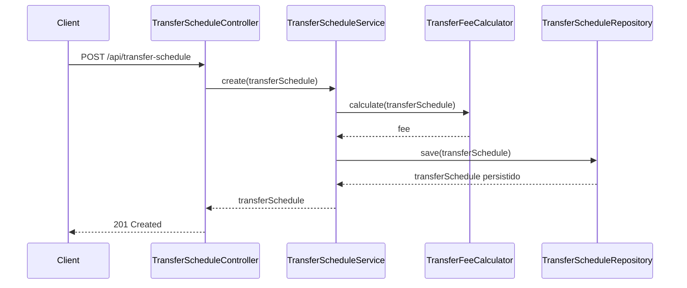

# Transfer Scheduler API

API para agendamento de transferências financeiras, desenvolvida como desafio técnico.

## Versões e ferramentas

- **Java 11**
- **Spring Boot 2.7.18** (Web, Data JPA, Validation)
- **Maven** (build)
- **H2** (banco de dados em memória)
- **Lombok**

## Decisões arquiteturais

- **Camadas**: `api` (controllers, DTOs, mapper, tratamento de exceções) separada de `domain` (entidade, repositório, regras de negócio), para manter a lógica de cálculo de taxa e validações desacopladas do transporte HTTP.
- **Cálculo de taxa isolado** em `TransferFeeCalculator`, componente próprio, para não misturar regra de negócio com persistência (`TransferScheduleService`).
- **Validação em duas camadas**: Bean Validation (`@Valid`) no request da API para formato dos dados, e validação de domínio na entidade/calculadora para invariantes de negócio (ex: conta com 10 dígitos, transferência sem taxa aplicável acima de 50 dias).
- **Persistência em memória (H2)**, conforme exigido pelo desafio. `data.sql` popula 5 registros de exemplo na subida da aplicação.
- **Paginação** no `GET /api/transfer-schedule` via `Pageable` do Spring Data, evitando retornar toda a base de uma vez.
- **Clean Code / DDD de forma pragmática**: a separação `api`/`domain`, a entidade com fábrica (`TransferSchedule.create`) e a regra de negócio fora do controller seguem princípios desses estilos, mas sem a intenção de implementar DDD completo (sem agregados, value objects ou bounded contexts). O escopo do desafio não justifica esse nível de formalismo.

## Fluxo de criação de um agendamento



## Regra de cálculo da taxa

| Dias até a transferência | Taxa |
|---|---|
| 0 (mesmo dia) | R$ 3,00 fixo + 2,5% sobre o valor |
| 1 a 10 | R$ 12,00 fixo |
| 11 a 20 | 8,2% sobre o valor |
| 21 a 30 | 6,9% sobre o valor |
| 31 a 40 | 4,7% sobre o valor |
| 41 a 50 | 1,7% sobre o valor |
| acima de 50 | não permitido (erro de domínio) |

## Endpoints

- `POST /api/transfer-schedule`: cria um agendamento de transferência.
- `GET /api/transfer-schedule`: lista os agendamentos (paginado, `?page=&size=`).

## Como rodar

Pré-requisito: JDK 11.

```bash
./mvnw spring-boot:run
```

A API sobe em `http://localhost:8080`.

- Console do H2: `http://localhost:8080/h2-console` (JDBC URL: `jdbc:h2:mem:transferscheduler`, usuário `sa`, sem senha).

## Testes

```bash
./mvnw test
```

## Possíveis melhorias

O desenvolvimento foi feito em cerca de 1 dia de dedicação não integral, então o foco foi implementar o que foi pedido no enunciado. Pontos que ficaram de fora e valeriam entrar em uma próxima iteração:

- **CRUD completo**: hoje só existe criação e listagem; faltam consulta por id, atualização e cancelamento de um agendamento.
- **Idempotência**: um retry de rede no `POST` pode criar agendamentos duplicados; caberia uma idempotency key no header, validada antes de persistir.
- **Concorrência**: nada impede duas requisições simultâneas agendarem a mesma transferência duas vezes; lock otimista (`@Version`) resolveria a maioria dos casos, com lock pessimista só se houver contenção real na mesma conta.
- **Compensação**: não há rollback de negócio se uma etapa posterior (ex: notificação, integração externa) falhar depois do agendamento persistido. Hoje é só uma transação de banco local.
- **Conta de origem igual à de destino**: não é validado hoje; deveria ser rejeitado no domínio (`TransferSchedule`/`TransferFeeCalculator`).
- **`TransferFeeCalculator`**: hoje é uma cadeia de `if/else` por faixa de dias. Daria para extrair em `Strategy` ou `Chain of Responsibility`, um por faixa. Para as 7 faixas atuais isso tende a ser complexidade desnecessária; só compensaria se o número de faixas ou a lógica de cada uma crescesse.
